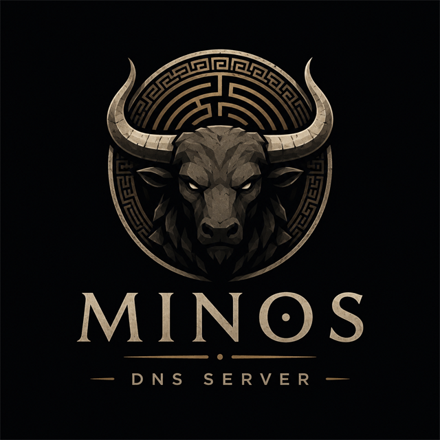

<p align="center">
  
</p>

# Minos

> Every query gets judged.

Minos is a modern, user-friendly DNS sinkhole (a Pi-hole alternative) written
in Go — a single static binary with an embedded web UI, light enough for a
Raspberry Pi. Named for the judge of the underworld: every DNS query that
arrives is judged against your blocklists and sentenced — no exceptions,
no appeals (well, except pardons).

## What it does

- Listens for DNS queries on `:53` (UDP + TCP)
- Judges each query against compiled blocklists (hosts, plain, and AdBlock formats)
- Blocked queries get `0.0.0.0`/`::` or `NXDOMAIN` (your choice)
- Allowed queries are forwarded upstream over DoH or DoT (plaintext optional)
- Repeat queries answered from a built-in response cache — no upstream trip
- Local DNS records for your LAN (`nas.home.lab`, wildcards, CNAMEs, PTR)
- Conditional forwarding: route `lan` or your reverse zone to the router
- Web dashboard with query charts, top blocked domains, and busiest clients
- Live query log streamed to the UI, with one-click allow/block from any row
- Device tracking (IP, MAC, hostname) with per-device groups: extra rules,
  full bypass, or no DNS at all — and a one-click block for any device
- One-click blocked services (TikTok, YouTube, Discord…) — globally or
  per group, with optional schedules ("no social media after 21:00")
- Full management from the UI: blocklists, allow/deny domains, upstreams,
  blocking mode, retention, API token — all applied live, no restarts
- Batched SQLite persistence that respects SD cards
- No telemetry. Ever.

## Quick start

```sh
make build          # builds web UI + single binary into bin/minos
./bin/minos serve   # starts DNS on :53 and the web UI on :8080
```

First run writes a commented default config to `minos.yaml`. Point a device's
DNS at the machine running Minos and open `http://<host>:8080`.

CLI verbs talk to the running instance:

```sh
minos status        # counters, rules, pause state
minos pause 5m      # pause blocking for five minutes
minos resume        # resume blocking
```

For local development without root, set `dns.listen: ":5353"` in the config
and test with `dig @127.0.0.1 -p 5353 doubleclick.net`.

## Deploying on a Raspberry Pi (or any Linux box)

Run Minos as a systemd service so it starts on every boot:

```sh
sudo install -m 755 bin/minos /usr/local/bin/minos
sudo cp deploy/minos.service /etc/systemd/system/
sudo systemctl enable --now minos
```

Before first start, free port 53 (disable the `systemd-resolved` stub
listener or `dnsmasq`), give the machine a fixed IP, and firewall ports
53/8080 to your LAN only — the step-by-step walkthrough is in
[docs/getting-started.md](docs/getting-started.md), including host tuning
notes for busy networks. Then point your router's DHCP DNS option at the
machine and every device follows.

`deploy/` also has a multi-arch Dockerfile and compose example
(`restart: unless-stopped` gives the same boot behavior).

## Roadmap

Family controls (blocked services, schedules, Safe Search), a Pi-hole
importer, Prometheus metrics, and serving DoH/DoT to clients are next —
the full plan and reasoning are in [docs/roadmap.md](docs/roadmap.md).

## Developing

Go 1.22+, Node 20+. `make test` runs the Go suite with the race detector;
`make lint` runs golangci-lint and the frontend type check; `make bench`
runs the filter engine benchmarks. See `CLAUDE.md` for architecture,
conventions, and performance budgets.

## License

GPLv3.
